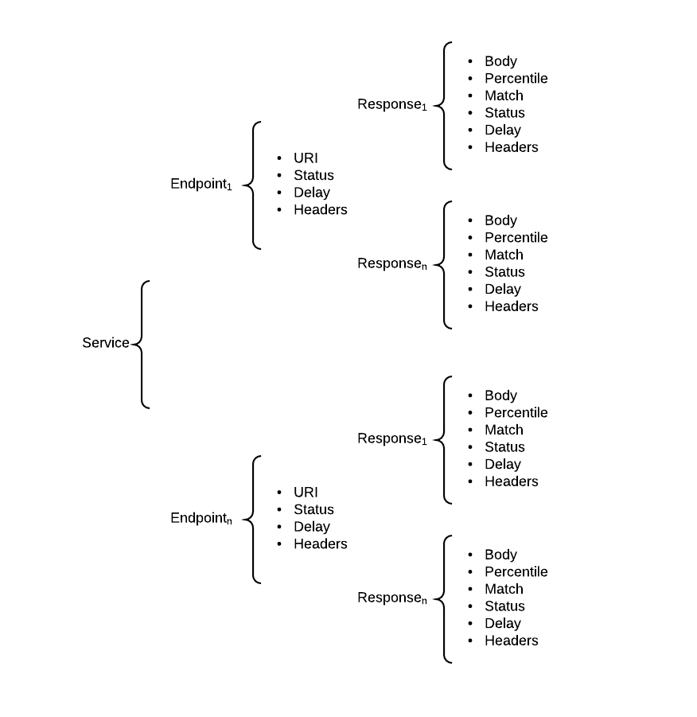

This project provides an HTTP server implementation that can be used to mock the functionality of a service API. Using the mock server allows client development and testing without the need for the actual service to be available. It can also be used to prototype a hypethetical service interface without the need to actually implement it. The mock service is suitable for both stress/performance and unit/feature testing use cases.

The various endpoints that comprise the service are configured to return canned responses. Responses are generally statically configured, however the server makes available an expression language (EL) allowing response data to be set dynamically based on runtime state.

## Expression Language
The expression language defines a mechanism for injecting dynamic content into an otherwise static response. An expression is indicated using a ```${...}``` format. When encountered, content within the braces is evaluated and an attempt is made to resolve the expression using the runtime request context. An expression takes one of the forms listed below.

### Named Parameter
A named parameter has the form ```${name}``` where *name* is the name of a
* path segment parameter (see Endoint below for details)
* request header name
* query parameter name
* form parameter name

### Method Invocation
A method invocation has the form ```${class.method(params)}``` where *class* is the name of a built-in evaluator, *method* is the name of the method to be invoked on the built-in type, and *params* are zero or more parameters passed to the method. Built-in types and their usage are listed below. The result of a method invocation replaces the declaration in the content under evaluation.

#### request
This type exposes the current instance of ```javax.servlet.http.HttpServletRequest```. All public instance methods are exposed via reflection.

#### random
This type provides a set of random value generators
* uuid(): generates a random UUID
* integer():  generates a random integer value
* long(): generates a random long value

#### date
This type provides basic date/time functioality
* now(): current time as UNIX-style value
* now(format): current time formatted using the provided ```java.text.DataFormat``` conformant format specification

#### string
This type exposes all public instance methods of ```java.lang.String``` using reflection. In addition to any parameters specified by a method signature, an instance parameter must be specified as the first positional parameter and will be used as the target of the method invocation.

## Service Configuration

The figure below depicts the available configuration types and their relationships.



### Service
The configuration as a whole defines the service that will be exposed by the Jetty HTTP server instance. A service is composed of one or more endpoints.

### Endpoint
A service endpoint represents an HTTP request/response message. An endpoint is selected by matching the request path to a URI assigned to the endpoint. Each endpoint returns exactly one HTTP response, comprised of a response code, zero or more response headers and optionally a response body. The following settings can be configured for an endpoint:

#### uri
The request path to match. A path is composed of zero or more segments. Multiple segments are separated using the '/' character. All paths are absolute and must start with '/'. Segments can be specified in named variable format. When matched, the corresponding segment value is made available to the response. For example, given uri configuration
```
/foo/${bar}/bas
```
If the path ```/foo/bar/bas``` is requested, it will match this endpoint and the EL varible ```${bar}``` will evaluate to ```bar``` and is available in reponse definitions. This setting is required for all endpoints.
#### method
The HTTP method to match. If omitted, the endpoint will match any method.
#### status
The default HTTP status code for all responses returned by the endpoint. Each response may independently override this value by explicitly defining its own value. If omitted, the default response code is ```200```.
#### delay
The response can be delayed to mimic processing time. This setting specifies the default delay time in milliseconds for all responses reutrned by the endpoint. Each response may independently override this value by explicitly defining its own value. If omitted, the default value is ```0```, indicating no delay.
#### response
An enpoint responds to a request with exactly one response. Multiple responses can be configured to be conditionally selected, based on dynamic criteria.

### Response
Specifies an HTTP response to be returned in response to an HTTP request. A response is composed of an HTTP status code, zero or more response headers and optionally a response body.

#### delay
Specifies the amount of time in milliseconds to delay this response when selected. This value overrides any default specified by the enclosing endpoint. When omitted, the corresponding endpoint default value is used.
#### status
Specifies the HTTP status code to be returned with this response when selected. This value overrides any default specified by the enclosing endpoint. When omitted, the corresponding endpoint default value is used.
#### percentile
Allow a reponse to be selected as the return payload by a percentage of all requests that match the enclosing endpoint. The is no default value.
#### headers
Specifies zero or more HTTP response headers to be returned with this response when selected. The value of a header may include EL named parameters.
#### body
Specifies an optional body to be returned with this response when selected. The value of the body may be either inlined text or an external resource containing the text to be returned. External resources are defined as URI's and the following schemes are supported:
```
classpath:body.json
```
Use the content of resource ```body.json``` as the body where ```body.json``` is available on the classpath.
```
file:/path/to/body.json
```
Use the content of the existing file ```/path/to/body.json```, present on the filesystem.
```
/path/to/body.json
```
Use the content of the existing file ```/path/to/body.json```, present on the filesystem. The default scheme is ```file:```.


The value of a header may include EL named parameters.

### Example
In the example below, a hypothetical service is configured to have a single endpoint `/path/to/get/something` that can respond
with one of three different responses.

```json
[
	{
		"uri": "/path/to/get/something",
		"method": "GET",
		"status": 200,
		"delay": 0,
		"response": [
			{
				"percentile": 98,
				"delay": 700,
				"headers": {
					"Cache-Control": "private",
					"Content-Type": "text/json; charset=utf-8",
					"Server": "192.168.1.1",
					"X-Powered-By": "Jetty 9.2",
					"Date": "${date.now('EEE, dd MMM yyyy HH:mm:ss z')}",
					"Connection": "Keep-Alive"
				},
				"body":"file:/Users/me/Documents/test/sample.txt"
			},
			{
				"percentile": 1,
				"delay": 100,
				"status":500,
				"headers": {
					"Cache-Control": "private",
					"Content-Type": "text/html; charset=utf-8",
					"Server": "192.168.1.1",
					"X-Powered-By": "Jetty 9.2",
					"Date": "${date.now('EEE, dd MMM yyyy HH:mm:ss z')}",
					"Connection": "close"
				},
				"body": "<html><body><div>Status: failed Message: Testing service errors</div></body></html>"
			},
			{
				"percentile": 1,
				"delay": 5000,
				"headers": {
					"Cache-Control": "private",
					"Content-Type": "text/json; charset=utf-8",
					"Server": "",
					"X-Powered-By": "",
					"Date": "${date.now('EEE, dd MMM yyyy HH:mm:ss z')}",
					"Connection": "Keep-Alive"
				},
				"body": {"foo":"foo","bar":"bar", "foobar": ["foo","bar"]}
			}
		]
	}
]
```

## Stand-alone Execution
The mock service can be launched either from the Maven project or as an executable JAR file. All arguments begin with '--'. 
The following arguments are available:

*	config

	path to the service configuration file.
*	host

	the address the server will `bind` to, defaults to `127.0.0.1`.
*	port

	the port number the server will listen on, defaults to `8080`.
*	trace

	enable logging of incoming service requests, defaults to `false`
*	debug

	log verbose debugging information, defaults to `false`
*	captureEnabled

	enable capture of request/response information that can be queried later, defaults to `false`
	TODO: document capture query

### Executable JAR
This style of execution is suitable when you simply want to use the service. Download the JAR file and run Java from a shell:

>`$ java -jar rnott-mock-<version>.jar --config="<path-to-service-config>" --host=<interface> --port=<port-number> --trace=true|false --debug=true|false --captureEnabled=true|false`

### Maven
This style of execution targets the developer actively working on this project, as it enables an edit, compile, test, run workflow
with a single command. From the project base directory, run Maven from a shell:

>`$ mvn exec:java -Dexec.args="--config="<path-to-service-config>" --host=<interface> --port=<port-number> --trace=true|false --debug=true|false --captureEnabled=true|false"`

